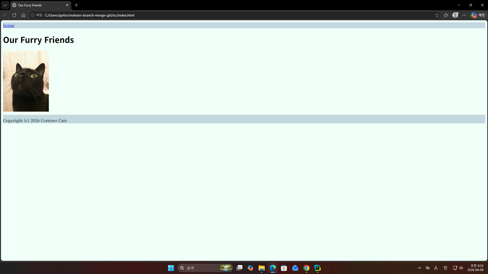

<h3>장고 튜토리얼 후기</h3>

- 스스로 무언가를 하루만에 완료해 보기는 오랜만이라 뿌듯함과 더 장고에 알아가고 싶은 마음이 생겼다.

- log가 실제 DB에 저장이 돼어 웹페이지 화면이 기록들이 남는 과정이 신기했다.

<h3>장고에 대해 기억남는 점</h3>
- 장고는 전부 다 갖춰진 프레임워크로 빠르게 웹 페이지를 제작할 수 있게 도와준다.
# branch-merge-git   

간단한 HTML 웹페이지 만들기입니다.  
[깃허브 연습](https://www.notion.so/GitHub-33d29c8c1191804095bec144b91ccc2d?source=copy_link)

| 가이드| 팀원 |
|----|------|
| ALICE | 김채린 |
| CAT | 서우리 |
| BOB | 이고은 |

팀원 세사람은 깃허브 연습 가이드를 따라하기 진행 해 보세요.  
ALICE의 역할은 김채린이 맡고, CAT의 역할은 서우리가 맡고, BOB의 역할은 이고은이 맡아주세요.  
세 사람은 각각의 브랜치를 만들고 있습니다.  
자신의 브랜치에서 기여한 코드가 다른 사람의 브랜치에 진행 과정을 협력하고 있습니다.  
중간에 충돌이 발생하는데 이슈를 기록하고 충돌을 해결 할 수 있도록 하는 연습을 가이드대로 따라 해 주세요.  
최종적으로 메인브랜치로 통합한 결과를 깃허브에 업로드 해 주세요.

양예지는 자신의 브랜치를 만들고 장고 튜터리얼 소스코드를 완성하여 깃허브에 업로드 해 주세요.  
[Django Tutorial](https://code.visualstudio.com/docs/python/tutorial-django)
